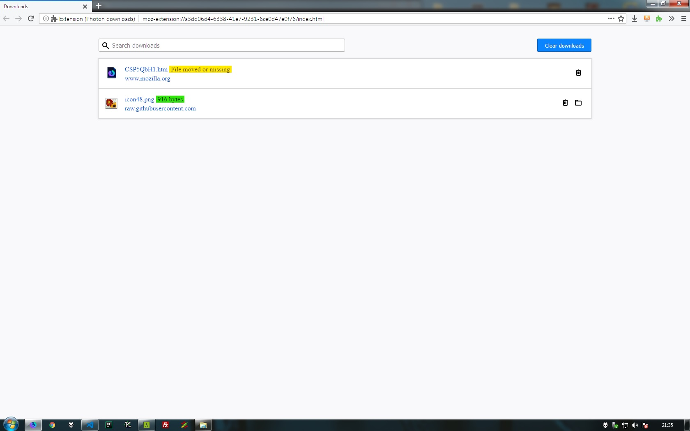

# About
I was a firefox user for a long time, but then i had to switch to another browser because it was slow and unnusable. Since the Quantum era im a happy firefox user again. Everything is fast as hell and the Photon ui its awesome, everything its unified, except for a forgotten place, the library view. Although we have a new fancy viewer, when you want to see all the downloads you still have something that seems out of place with respect all the UI. So i made this proof of concept to show how a Photonish download library could be.

Current fancy viewer

Out of place widget

Photonish concept

# Using
First you have to download the *ext* folder from this repo, go to *about:debugging* click on *load temporary addon* and find the *manifest.json* file. After this, a new button on the toolbar will be created and when clicked will open the page.

# Status
Currently it only shows downloads that are finished, the buttons to open the folder and remove from the history and also the clear all button are all working.